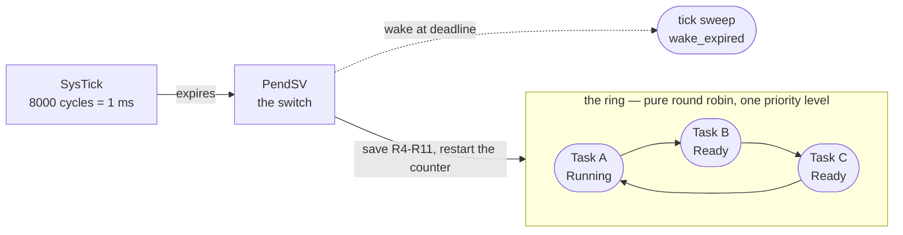

<div align="center">

# rrkernel

**A preemptive round-robin RTOS kernel in Rust.**
One API, from a Cortex-M0 to your desktop — timing you state in cycles, size measured in kilobytes.

[](https://www.rust-lang.org)
[](#)
[](LICENSE)
[](#)
[](#testing--ci)
[](#where-it-has-actually-been-run)

</div>

> **The short version.** Every task gets the same slice, chosen once at startup, and hardware
> guarantees it is honoured — even when a task never yields. You write `thread::spawn(|| …)` with
> closures, exactly like desktop Rust.

<details>
<summary><b>What it looks like, in 20 seconds</b></summary>

```rust
use rrkernel::{configure, thread, Duration, Slice};
use rrkernel::rrkernel;

#[rrkernel(log = rtt)]
#[cortex_m_rt::entry]
fn main() {
    configure(8_000_000, Slice::Millis(1), 1024);   // clock, slice, stack — that is the contract

    thread::spawn(|| loop {                          // CPU-bound, never yields:
        core::hint::spin_loop();                     // preempted by hardware every millisecond
    });

    thread::spawn(|| loop {
        led.set_low();
        rrkernel::sleep(Duration::from_millis(500));  // no CPU burnt while waiting
        led.set_high();
        rrkernel::sleep(Duration::from_millis(500));
    });
}
```

No priorities. No `unsafe` in application code. No allocator. Two files: your `main.rs` and a
`memory.x` your chip crate usually ships anyway.

</details>

---

## Why another RTOS?

**The problem.** On a microcontroller, *"it usually keeps up"* is not a specification. Control loops,
sampling and protocol timing need a bounded **worst case**: a guaranteed slice, a guaranteed switch
cost, and a guarantee that no single task can hold the CPU hostage.

**The gap in the obvious choices.**

| Option | What it gives you | Where precise timing suffers |
|---|---|---|
| **Superloop + `delay()`** | nothing to learn | one blocking call delays everything; each job's timing depends on the slowest other job |
| **FreeRTOS / Zephyr (C)** | everything, configurable | priorities and priority inheritance turn the worst case into an *analysis problem* rather than a fact, and the scheduler is a black box from Rust |
| **RTIC** | compile-time, zero-cost, superb for interrupt logic | it is an interrupt/resource framework, not a time-sliced scheduler: CPU-bound tasks are not preempted against each other |
| **Embassy** | beautiful async I/O on one stack | cooperative: a future that does not yield stalls everything, and there is no preemption between independent workloads |
| **`std::thread` (desktop)** | familiar, preemptive | needs an OS, an allocator and megabytes; the slices you get are the OS's guess |

**How `rrkernel` answers it.**

- **A slice you can state in cycles.** `Slice::Millis(1)` on an 8 MHz part is exactly 8000 `SysTick`
  cycles — measured, not approximated, and validated at init rather than silently clamped.
- **Preemption is the guarantee, not a feature.** A task that never yields is throttled by hardware:
  every other task's worst case is `(N-1)` slices whether the offender cooperates or not.
- **The switch is engineered and measured.** 38 cycles typical, 80 worst on an STM32F103 at 8 MHz,
  because the timer counter restarts on every switch and error cannot accumulate.
- **Rust all the way down, without giving up the desktop.** The same ring, counters and API run on
  Windows and Linux, so timing-sensitive logic is developed and tested on a laptop and flashed
  unchanged.
- **Nothing in your way.** Task bodies are ordinary closures; `unsafe` stays in the kernel, the ports
  and the macro.

## What "precise" means here

Measured on an STM32F103C8 at 8 MHz with 1 ms slices (`cargo run --release --bin fidelity` in
`examples/cortex-m-bluepill` — reproducible on your board).

| Metric | Measured | How |
|---|---|---|
| Slice length | **1 000 000 ns exactly** (8000 cycles) | `SysTick->LOAD`, chosen so the request is whole cycles |
| Slice accuracy | **2 674 ns** worst error under full load | `DWT->CYCCNT` sampled in the tick handler |
| Switch cost | **38 cycles typical / 80 worst** | `DWT` around the Rust half of `PendSV` |
| Sleep precision | **601 sleeps: 0 early, 0 late** | every sleep checked against its own request |
| Idle behaviour | **1 `wfi` per tick**, core parked between ticks | `idle_waits` counter + a verified sleep window |
| Fairness | equal slices per task, no starvation | pure round robin by construction |

---

## How it works



### The slice is the whole contract

The only scheduling knob is the slice, fixed before the first task runs:

```rust
configure(core_clock_hz, Slice::Millis(1), stack_bytes);
```

- The request becomes **whole timer cycles** and is reported back — `scheduler::slice_ns()` prints
  what you actually got. A slice the hardware cannot honour is **rejected at init**, never clamped.
- **Every switch restarts the counter**, so the successor always gets a complete slice: an early
  exit, a spawn or a block cannot shorten anyone else's turn.
- Sleeping is an **absolute deadline on the global tick**, not a per-task countdown, so a late
  wake-up is corrected on the next period instead of accumulating.

### What happens on a switch

| Step | Where | Cost |
|---|---|---|
| `SysTick` expires | hardware | — |
| `on_tick()`: count the tick, wake expired deadlines | Rust, in the ISR | a few dozen cycles |
| `PendSV` is pended (lowest priority, so it never preempts another ISR) | `SysTick_Handler` | 1 store |
| Save R4–R11, publish SP, walk the ring, restore the successor | asm + `schedule_next` | **38–80 cycles** |
| Restart the slice counter (`SysTick->VAL = 0`) | asm | 1 store |

### Guarantees

| Guarantee | Bound | Why it holds |
|---|---|---|
| A **runnable** task runs within | `(N-1) × (slice + switch)` | one lap of a pure round-robin ring |
| A task blocked on a lock or I/O runs within | its deadline, plus that same bound after the wake | keyed blocking; waking is O(1) |
| Worst-case switch time | `(N-1)` ring steps + the measured switch | sleepers stay in the ring, so the walk grows with N |
| No task can starve a peer by not yielding | hardware-enforced | the tick is a hardware interrupt |
| Switching is allocation-free and O(1) | always | O(1) unlink, bump arena, deferred free |

> The `(N-1)` bound covers tasks that are **runnable**. A task waiting on a lock is bounded by the
> holder's progress instead: the static lock-order rule keeps that chain finite, but it is not
> `(N-1)` slices, and the documentation says so rather than pretending otherwise.

### Sleeping, blocking, yielding — one mechanism

Everything funnels through a single blocking primitive: the deadline is read, the state becomes
`Blocked`, and the switch is pended **inside one critical section**, so a tick can never observe a
half-formed waiter.

| You write | What happens | Cost while waiting |
|---|---|---|
| `rrkernel::sleep(d)` | parks until an absolute tick | 0 CPU |
| `signal.wait(deadline)` | parks until an ISR `set`s it | 0 CPU, woken in O(1) |
| `scheduler::yield_now()` | gives up the slice, stays `Ready` | 1 switch |
| `fut.await` under `exec::block_on` | parks on `Pending`, re-polled on wake | 0 CPU |
| `embedded_io::Read` on a `Pipe` | parks the reader, the ISR wakes it | 0 CPU — **measured: 0 slices** |
| `wait_until(ready, deadline)` | yields once per poll (no interrupt to wait on) | 1 switch per poll, never starves |

An `nb::WouldBlock`, a `Pending` future, a `Signal` that has not fired, and a task with nothing to do
are all "give the slice back now": the round robin continues instead of spinning.

### How it shapes your application

| Instead of | You write |
|---|---|
| priorities to stop one job hogging the CPU | nothing — the slice does it |
| `while flag {}` polling or a hand-tuned delay | `signal.wait(timeout)` / `fut.await` |
| a state machine split across `switch` cases just so it can yield | an ordinary function, or an `async fn` that awaits |
| `static mut` with `unsafe` accessors | closures that capture their own state (`Send + 'static`) |
| a hand-written "idle task" | none — the kernel parks the core when nothing is runnable |
| two copies of a driver for blocking and async callers | one async driver + `hal::Blocking` |

## Key features

- **Preemptive round robin, one priority level.** No priorities, no priority inheritance, no work
  stealing, no preempt-on-wake: a woken task waits its turn.
- **Cycle-exact slices** chosen at init, validated against the hardware, restarted on every switch.
- **`#[rrkernel]`** installs the entry point, the configuration, the vector wiring, the panic and
  fault handlers, an optional RTT log sink and task 0 — your `main` stays short.
- **Familiar API.** `thread::spawn` takes `FnOnce() + Send + 'static`, exactly like `std::thread`;
  `sleep(Duration)`, `now()`, `deadline_after`, `spawn_async`.
- **Events and waiting:** `Signal` (ISR-safe and race-free), `WaitQueue` (single-wakeup hand-off),
  `park`/`wake`/`TaskId`, `yield_now`, and a poll-yield fallback with a mandatory deadline.
- **Async without an executor dependency:** `exec::block_on`, a task `Waker`, `Sleep`, `spawn_async`
  — `core::future` only, no allocator, futures live on their task's own stack.
- **The standard embedded traits, always available** (no feature flags to discover):
  `embedded-hal` + `embedded-hal-async` for delays, a blocking facade over an async driver and a
  kernel-mutex shared-bus device; `embedded-io` + `embedded-io-async` for the ISR-driven `Pipe`.
- **`core`-only kernel.** No `alloc`, no libc; TCBs, closure blobs and stacks come from a bump arena
  with deferred reclamation.
- **Six ports, one API:** Cortex-M0/M0+/M3/M4/M33, RISC-V 32, ARM A/R, Xtensa, plus Windows and Linux
  backends so you can develop and test on a laptop.
- **Measured, not claimed.** Every number in this README comes from a counter in the kernel
  (`scheduler::stats()`), reproducible on real hardware.

---

## Where it has actually been run

| Target | Real hardware | QEMU | Host tests | Builds |
|---|---|---|---|---|
| **Cortex-M3** — STM32F103C8 ("Blue Pill") | ✅ **`VERDICT : PASS`** — 601 sleeps, 0 early, 1 `wfi`/tick, switch 38/80 cycles | runs, no faults | — | ✅ |
| **Cortex-M4** — STM32F401 ("Black Pill") | LED + threads run; RTT blocked by a probe-rs flashing quirk | — | — | ✅ |
| **Cortex-M0 / M0+** (`thumbv6m`) | not yet on a board | — | — | ✅ |
| **Cortex-M33** (`thumbv8m.main`) | no | — | — | ✅ |
| **RISC-V 32** (`riscv32imac`) | no | ✅ `VERDICT : PASS`, exits 0 | — | ✅ |
| **ARM A/R** (`armv7a`, `armv7r`) | no | ✅ `VERDICT : PASS` (guest never exits) | — | ✅ |
| **Xtensa LX6** (ESP32) | no | boots, switch runs, **resume wrong → no verdict** (`docs/ESP32.md`) | — | nightly only |
| **Windows** (`win32`) | n/a | — | ✅ 23 tests | ✅ |
| **Linux** (`posix`) | n/a | — | ✅ 23 tests (WSL) | ✅ |
| **macOS** | no | — | — | `compile_error!` — work list in `docs/PORTING.md` |

## Testing & CI

```bash
cargo test --features std                                     # 23 tests: ring, arena, closure, ABI, events
cargo clippy --all-targets --features std -- -D warnings       # clean on host + all six bare-metal targets
cargo fmt --all --check
cargo run --example sleep_fidelity --features std              # sleep fidelity + idle window
cargo run --example io_layers --features std                   # I/O layers acceptance
cargo run -p firmware-riscv  --target riscv32imac-unknown-none-elf --release   # QEMU verdict
cargo run -p firmware-arm-a  --target armv7a-none-eabi             --release   # QEMU verdict
cd examples/cortex-m-bluepill && cargo run --release --bin fidelity            # on your board
```

CI runs four jobs: `posix-core` (fmt, clippy, tests, examples), `windows`, `bare-metal` (build **dev
and release** for six targets + clippy), and `qemu` (verdicts for RISC-V 32 and ARM A/R). The dev
build matters: `lto = "fat"` defers codegen, and a release-only build once hid a real compile error.

## Honest limits

<details>
<summary><b>What is known to be incomplete or unproven</b> — click to expand</summary>

- **Host tick source in some task sets.** On Windows *and* Linux, `tick_count()` has been observed to
  stay `0` from init in the `io_layers` scenario, which stalls deadline-based paths (timeouts, async
  timers). The blocking-I/O paths are unaffected, and the metal port ticks normally (3254 ticks
  measured). `examples/io_layers.rs` exits 3 with that diagnosis instead of hanging.
  Reproduced from a **published** consumer (a fresh project, `cargo add rrkernel --features std`, a
  2 ms slice, three tasks): the first `sleep` returns immediately and `stats().ticks` reads `0` while
  a task's own `now()` had already reached `10` — the two readings disagree, which is a sharper clue
  than the stall itself. Metal is unaffected: the board measures 3254 ticks and 0 early sleeps.
- **Asymmetric parking on the host backends.** On every bare-metal port a blocking call has taken the
  caller off the CPU before it returns. On Win32 the tick thread parks the task a moment later; on
  POSIX the `SIGALRM` handler has no idle context to switch to when nothing is runnable. Each port
  reports this through `arch::parks_synchronously()`, and `sleep_fidelity` gates its strict form on it.
- **The `layers` firmware flashes but prints nothing** (park/async/pipe demo). `fidelity` on the same
  probe prints and passes, so it is the new binary or the async path, not the toolchain. Under
  investigation.
- **`sync::Mutex` and multi-core are not hardware-verified.** The lock layer compiles everywhere with
  32-bit atomics and its lost-wakeup path is fixed and reasoned about; the shared-bus device built on
  it has not been exercised on a real bus. Multi-core validates and refuses `active_cores > 1` rather
  than pretending: no port starts a secondary core, and `-smp 2` has never been run.
- **The Xtensa port does not pass** (`docs/ESP32.md`), and macOS is a `compile_error!` until its
  `sigaction`/`sigevent` layouts are adapted.
- **The crate has dependencies.** The *kernel core* is `core`-only with no allocator, but the crate
  always pulls `embedded-hal`, `embedded-hal-async`, `embedded-io` and `embedded-io-async` (all
  `no_std`). That is the deliberate cost of making the standard traits available without feature flags.
- **1-hour soak tests and physically unplugged peripherals** are not automated anywhere yet.

</details>

---

## Quickstart

<details open>
<summary><b>On a board</b> (STM32F103 "Blue Pill")</summary>

`Cargo.toml`

```toml
[dependencies]
rrkernel = "0.3"
cortex-m = { version = "0.7", features = ["critical-section-single-core"] }
cortex-m-rt = "0.7"
rtt-target = "0.6"          # only if you want `log = rtt`
```

`.cargo/config.toml`

```toml
[target.thumbv7m-none-eabi]
runner = "probe-rs run --chip STM32F103C8"
rustflags = ["-C", "link-arg=-Tlink.x"]
[build]
target = "thumbv7m-none-eabi"
```

`src/main.rs`

```rust
#![no_std]
#![no_main]

use rrkernel::{configure, thread, Duration, Slice};
use rrkernel::rrkernel;
use rtt_target::rprintln;

#[rrkernel(log = rtt)]              // entry point, vectors, panic + fault handlers, task 0
#[cortex_m_rt::entry]
fn main() {
    configure(8_000_000, Slice::Millis(1), 1024);

    thread::spawn(|| loop { core::hint::spin_loop() });      // never yields: still throttled
    thread::spawn(|| loop {
        rprintln!("tick at {} ms", rrkernel::now());
        rrkernel::sleep(Duration::from_millis(500));
    });

    // Returning from `main` is a task exit: task 0 is unlinked like any other.
}
```

Then `cargo run --release` flashes and streams RTT. Complete, working copies live in
[`examples/cortex-m-bluepill`](examples/cortex-m-bluepill) (F103) and
[`examples/cortex-m-blackpill`](examples/cortex-m-blackpill) (F401).

</details>

<details>
<summary><b>On a desktop</b> — same API, no hardware</summary>

```bash
cargo run --example roundrobin_demo --features std      # preemption, auto-unlink, report
cargo run --example sleep_fidelity  --features std      # sleep precision + idle windows
cargo run --example io_layers       --features std      # shared bus, ISR-driven pipe, async
```

The ring, counters and API are identical; only the backend differs (a waitable timer plus thread
suspend/resume on Windows, `SIGALRM` plus fibre switching on Linux). Timing limits are the host's,
and the examples report exactly what they measured — on one Windows machine a 1 ms slice is at the
edge of what the OS timer can honour, and the example says so.

</details>

### Waiting on hardware without burning the slice

```rust
use rrkernel::event::Signal;
use rrkernel::io::Pipe;

static RX: Pipe = Pipe::new();

#[cortex_m_rt::interrupt]
fn USART1() {
    while let Some(b) = read_hw_byte() {
        RX.push_from_isr(b);            // ISR-safe, allocation-free, wakes the reader
    }
}

thread::spawn(|| {
    let mut buf = [0u8; 64];
    loop {
        let deadline = rrkernel::deadline_after(Duration::from_millis(100));
        match RX.read_blocking(&mut buf, Some(deadline)) {
            Ok(n) => handle(&buf[..n]),
            Err(_) => {}                // Err(Timeout): the device went quiet
        }
    }
});
```

The reader is `Blocked` between bytes: **measured 0 slices consumed** while 71 bytes arrived.

### Async, when a state machine is easier to write

```rust
thread::spawn(|| rrkernel::exec::block_on(async {
    loop {
        rrkernel::exec::sleep(Duration::from_millis(100)).await;   // gives the slice back
        sample_and_filter().await;
    }
}));
```

A `.await` that returns `Pending` hands the CPU over immediately — same guarantee as a blocking
`sleep`, so an async task cannot starve anyone either.

### One bus, many tasks

```rust
use rrkernel::hal::MutexDevice;

// Acquired with a timeout, held across a whole transaction, released on drop. The loser is parked,
// not spun — and never `CriticalSectionDevice`, which would mask interrupts for the transfer.
static I2C: MutexDevice<MyI2c, 0x4000_0001> = MutexDevice::with_timeout(my_bus, 100);
```

An async driver can also be offered to blocking code without a second implementation:
`rrkernel::hal::Blocking::new(async_driver)`.

---

## The API in one screen

| Area | Items |
|---|---|
| **Start** | `configure(clock, slice, stack)`, `#[rrkernel(log = rtt)]`, `scheduler::init_with(cfg)` |
| **Tasks** | `thread::spawn`, `spawn_with_stack`, `try_spawn`, `scheduler::main_body`, `SchedulerConfig` |
| **Time** | `now()`, `sleep(Duration)`, `sleep_ms/us/secs/minutes/hours`, `deadline_after`, `deadline_add`, `sleep_until`, `ticks_for`, `tick_ns()` |
| **Events** | `Signal` (ISR-safe `set`/`wait`), `WaitQueue` (`wake_one`/`wake_all`), `park`/`wake`/`TaskId`, `yield_now`, `wait_until` |
| **Async** | `exec::block_on`, `exec::sleep`, `exec::spawn_async`, `exec::current_waker`, `SignalWait` |
| **Locks** | `sync::Mutex` (sleeping, static lock order, `try_lock_for`), `hal::MutexDevice` (shared bus) |
| **HAL/IO** | `hal::KernelDelay`, `hal::Blocking`, `io::Pipe` (`Read`/`Write`, blocking **and** async) |
| **Inspection** | `scheduler::stats()` (ticks, switches, worst period error, worst switch, arena, `blocks_without_current`), `for_each_task`, `platform_limits()`, `arch::idle_waits()` |

## Repository layout

```text
src/
  lib.rs          the public surface, in one file
  scheduler.rs    policy: init/config, schedule_next, blocking, wake, stats, spawn, reclaim
  event.rs        Signal, WaitQueue, park/wake, yield_now, wait_until
  exec.rs         block_on, Waker, Sleep, spawn_async
  hal.rs          KernelDelay, Blocking facade, MutexDevice (embedded-hal / -async)
  io.rs           Pipe: ISR-driven byte ring, embedded-io / -async Read+Write
  ring.rs tcb.rs arena.rs closure.rs trampoline.rs thread.rs time.rs config.rs
  arch/           one file per port: cortex_m, riscv, arm_ar, xtensa, win32, posix
  app_support.rs  what #[rrkernel] expands into, plus the RAM black-box log
examples/
  roundrobin_demo.rs sleep_fidelity.rs io_layers.rs smoke.rs jitter_bench.rs
  cortex-m-bluepill/  (F103: main + `fidelity` + `layers` binaries)
  cortex-m-blackpill/ (F401)
firmware-*/       the shared demo, cross-compiled per architecture (QEMU verdicts)
docs/             DESIGN.md (engineering record) · PORTING.md (port checklist) · ESP32.md
tests/            ring invariants · ring property tests · event state machines
```

## Roadmap

**Core kernel**

- [x] Preemptive round robin, one priority level, pure by construction
- [x] Slice planned in cycles at init, validated, restarted on every switch
- [x] Bump arena + deferred reclamation: spawn/exit at steady state
- [x] `(N-1)` worst-case bound instrumented in `stats()`
- [x] Sleep precision verified on hardware (601 sleeps, 0 early)
- [x] Idle path that genuinely parks the core (1 `wfi` per tick, measured)
- [ ] `max_tasks` cap and a published switch-cost-vs-N benchmark
- [ ] Stack canary / high-water marks in `stats()`
- [ ] `plan_timer` floor raised to 10× the measured switch cost (~800 cycles)

**Concurrency**

- [x] `park`/`wake`/`TaskId`, `Signal`, `WaitQueue`, `yield_now`, `wait_until`
- [x] Race-free waits: condition checked inside the blocking critical section
- [x] `sync::Mutex` with static lock order and timeouts
- [ ] `sync::Mutex` and the shared bus exercised on real hardware
- [ ] Interleaving tests over a mock arch layer

**Async & I/O**

- [x] `block_on`, `Waker`, `Sleep`, `spawn_async` (core-only, no executor dependency)
- [x] `embedded-hal` + `embedded-hal-async`: delays, blocking facade, shared-bus device
- [x] `embedded-io` + `embedded-io-async`: ISR-driven `Pipe`, 0 slices while blocked
- [ ] `SpiDevice` shared-bus impl (I2C is done; SPI follows the same shape)
- [ ] CAN / SD / ethernet / USB adapters
- [ ] 1-hour shared-bus soak test on hardware

**Ports**

- [x] Cortex-M (M0/M0+/M3/M4/M33) — **verified on an STM32F103C8**
- [x] RISC-V 32 (`riscv32imac`) — QEMU verdict
- [x] ARM A/R (`armv7a`, `armv7r`) — QEMU verdict
- [x] Windows and Linux host backends — 23 tests each
- [ ] Xtensa LX6 (ESP32): boot, switch and UART work; the resume is wrong
- [ ] macOS/BSD (POSIX layout adaptation), AVR (ATmega328P)
- [ ] Multi-core bring-up: `active_cores > 1`, `-smp 2`, per-core current state

**Time base**

- [x] `arch::cycle_counter()` on Cortex-M (DWT) and RISC-V (`rdcycle`)
- [x] `DWT->CYCCNT` measured across a *verified* sleep — it keeps counting, so DWT is usable
- [ ] `Instant` + 64-bit counter extension, so deadlines stop being tick counts

**Tooling & docs**

- [x] CI: fmt, clippy, tests, six-target builds (dev **and** release), QEMU verdicts
- [x] Property tests for the ring, model-checked against a `Vec` reference
- [x] `docs/DESIGN.md` §8: the measured engineering record, bugs included
- [ ] `docs/GUARANTEES.md` (bounds, how each was measured, on which chip)
- [ ] `docs/ASYNC_AND_IO.md` (the three layers, the wake protocol, timeout rules)
- [ ] Host tick source in the `io_layers` scenario; `layers` firmware RTT output

## Contributing

The most useful contributions, roughly in order:

1. **A board.** Port it to what you own — `docs/PORTING.md` is a checklist of about eleven functions,
   and a Cortex-M port is two files. A port that runs the shared demo to `VERDICT : PASS` is done.
2. **A failing test.** "This is broken, here is the trace" is as welcome as a feature; that is how
   most of the bugs in `docs/DESIGN.md` §8 were found.
3. **A measurement.** Hardware numbers with the chip and clock attached.

House rules, learned the hard way: never make a status table prettier than the truth; a silent failure
is a bug, not a hang; and a port must not skip the contract (`on_tick`, the `critical_enter` token
polarity, the full-slice restart).

## License

MIT — see [LICENSE](LICENSE). Use it on any board, including commercially. If you port it somewhere,
the only thing asked in return is that `docs/PORTING.md` gets the quirks you discovered.
